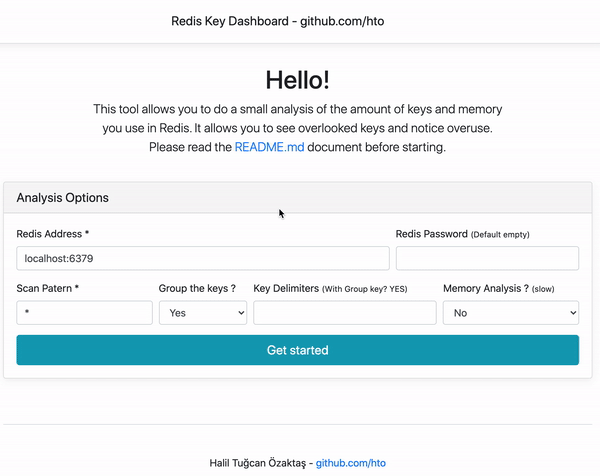

# Redis Key Dashboard

> This tool allows you to do a small analysis of the amount of keys and memory you use in Redis. It allows you to see overlooked keys and notice overuse.

> **Please read the [Wiki](https://github.com/hto/redis-key-dashboard/wiki) document before starting.**

---



---

## How to work ?

> Groups all keys with 'SCAN' by name. It then lists the dimensions it occupies in memory with the group prefixes that it determines. It does this in batches of 1000. Therefore, it does not create load on the CPU side during the process.

> If you just want to get the key list, it can extract 13-14GB of redis data in 50-55 seconds. **Warning** : Memory analysis increases the time spent.

## Usage

> Compile the code after cloning it into your computer. If you wish, you can protect your dashboard with **BasicAuth**.

```sh
git clone https://github.com/hto/redis-key-dashboard.git
```

```sh
go build

./redis-key-dashboard
```

> http://127.0.0.1:8080

## Running Alternatives

```sh
./redis-key-dashboard
./redis-key-dashboard -port=9090
./redis-key-dashboard -auth=user1:password
./redis-key-dashboard -auth=user1:password -port=9090
```

## Example Report

| Key                   | Count   | Size       |
| --------------------- | ------- | ---------- |
| users:data:\*         | 109270  | 832.476 MiB |
| users:products:pid:\* | 1410800 | 784.237 MiB |
| users:inbox:\*        | 593842  | 761.199 MiB |
| users:energy:\*       | 1176558 | 532.499 MiB |
| customer:bundle:\*    | 1417628 | 511.679 MiB |
| users:packages:\*     | 314613  | 426.036 MiB |
| toma:\*               | 1015310 | 323.098 MiB |
| hto:power:\*          | 869738  | 309.491 MiB |
| users:powers:\*       | 1404458 | 297.675 MiB |
| users:reward:\*       | 1544428 | 229.860 MiB |
| cards                 | 1       | 200.563 MiB |
| users:video:\*        | 575571  | 192.188 MiB |
